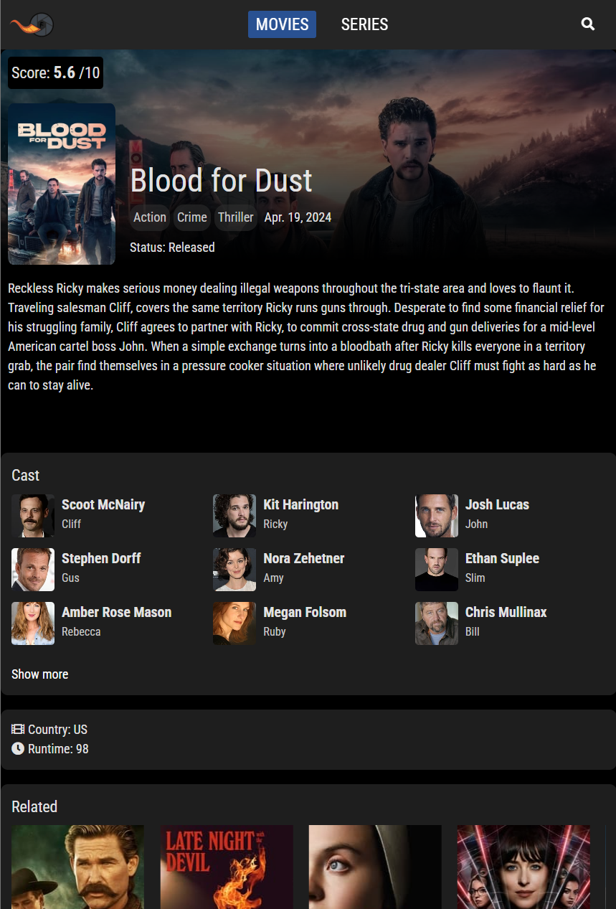

# 🎬 Filmema

Bienvenido a **Filmema**, una página web interactiva para explorar películas y series, con detalles completos y un práctico buscador. Este proyecto fue creado para aprender **React** junto con **Vite**, utilizando la API de **TMDB** para obtener toda la información necesaria sobre las películas y series.

## 🚀 Demo
[Visita Filmema en vivo](https://filmema.vercel.app)

## ✨ Funcionalidades

- **Exploración de películas y series**: Lista completa de películas y series populares.
- **Búsqueda inteligente**: Filtra fácilmente títulos a través del buscador.
- **Detalles completos**: Al hacer clic en un título, podrás ver detalles como el elenco, puntuación, sinopsis y películas relacionadas.
- **Interfaz moderna y responsiva**: Diseño optimizado para todo tipo de pantallas.

## 🛠️ Tecnologías Utilizadas

- **React**: Biblioteca principal para la creación de interfaces de usuario.
- **Vite**: Entorno de desarrollo ultrarrápido.
- **TMDB API**: API para obtener datos de películas y series.
- **Wouter**: Librería ligera para gestionar las rutas en React.
- **Custom Hooks**: Hooks personalizados creados para gestionar la lógica reutilizable.
- **React Context**: Utilizado con `useContext` para manejar el estado global.
- **CSS**: Para el diseño y el estilo del proyecto.
- **Axios**: Para realizar solicitudes HTTP a la API de TMDB.

## 📦 Instalación

Sigue estos pasos para configurar el proyecto en tu entorno local:

1. Clona este repositorio:

    ```bash
    git clone https://github.com/DavidVazquezRivas/filmema.git
    ```

2. Navega al directorio del proyecto:

    ```bash
    cd filmema
    ```

3. Instala las dependencias:

    ```bash
    npm install
    ```

4. Obtén una clave de API de [TMDB](https://www.themoviedb.org/), luego crea un archivo `.env` en la raíz del proyecto con la siguiente línea:

    ```bash
    VITE_TMDB_API_KEY=TU_API_KEY
    ```

5. Inicia el servidor de desarrollo:

    ```bash
    npm run dev
    ```

6. Abre tu navegador y accede a la aplicación en `http://localhost:5173`.

## 🖼️ Capturas de Pantalla (pueden estar desactualizadas)

### Pantalla principal


### Resultados de búsqueda


### Detalles de película/serie


## 📚 Aprendizajes

Este proyecto me permitió profundizar en los siguientes conceptos:

- Uso de **React Hooks** como `useState`, `useEffect` y `useContext` para manejar el estado y la lógica de la aplicación.
- Creación de **Custom Hooks** para extraer lógica reutilizable.
- Gestión de rutas con **Wouter**, una alternativa ligera a React Router.
- Consumo de APIs utilizando **Axios** y manejo de respuestas asincrónicas.
- Navegación dinámica y gestión del estado global con **React Context**.
- Optimización del rendimiento y la experiencia de usuario con **Vite**.

## 🔧 Funcionalidades Futuras

Algunas ideas para mejorar la aplicación:

- **Mejora la carga**: Mientras se hacen peticiones a la API se mostrará un loader como ahora, pero mientras cargan las imágenes se mostrará un placeholder
- **Mejora de filtros**: Filtrar películas y series por género, año de lanzamiento...
- **Personas**: Páginas de actores y directores donde se pueda ver su información y películas/series en que participan.
- **Usuarios**: Permitir el registro e inicio de sesión de usuarios.
- **Favoritos**: Guardar películas y series en una lista de favoritos.
- **Comentarios de usuarios**: Permitir a los usuarios agregar reseñas.

## 👤 Autor

Creado por [David Vázquez Rivas](https://github.com/DavidVazquezRivas) – ¡No dudes en contactarme!